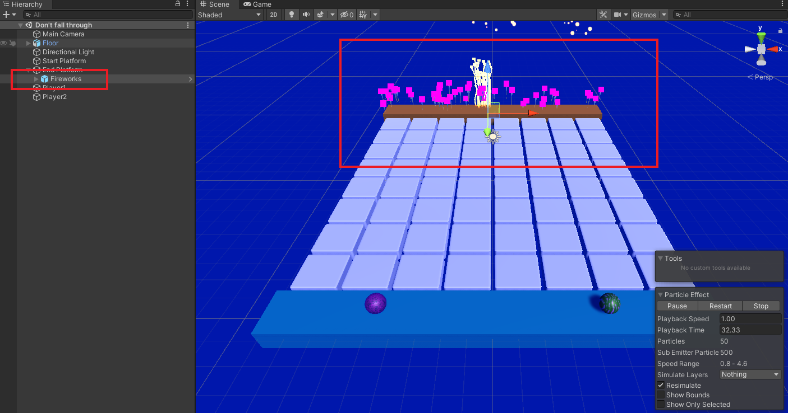

Add the 'Player' tag to the ball. 

In the 'Project' window, navigate to 'Assets -> Particle Systems'.

Drag the particle system onto the goal GameObject in the Hierarchy window. 

With the goal GameObject selected. Go to the 'Inspector' window and add a new script component called 'FinishEffects'.

Open the 'FinishEffects' script and enter the following code to trigger the particle system when a player reaches the goal. 

--- code ---
---
language: cs
filename: FinishEffects.cs
line_numbers: true
line_number_start: 1
line_highlights: 
---

using System.Collections;
using System.Collections.Generic;
using UnityEngine;

public class FinishEffects : MonoBehaviour
{
   ParticleSystem completeParticleSystem;

   void Start()
   {
       completeParticleSystem = GetComponentInChildren<ParticleSystem>();
   }

   void OnCollisionEnter(Collision other)
   {
       if (other.gameObject.tag == "Player")
       {
           completeParticleSystem.GetComponent<ParticleSystemRenderer>().material = other.gameObject.GetComponent<Renderer>().material;
           completeParticleSystem.Play();
       }
   }
}

--- /code ---

--- /task ---
